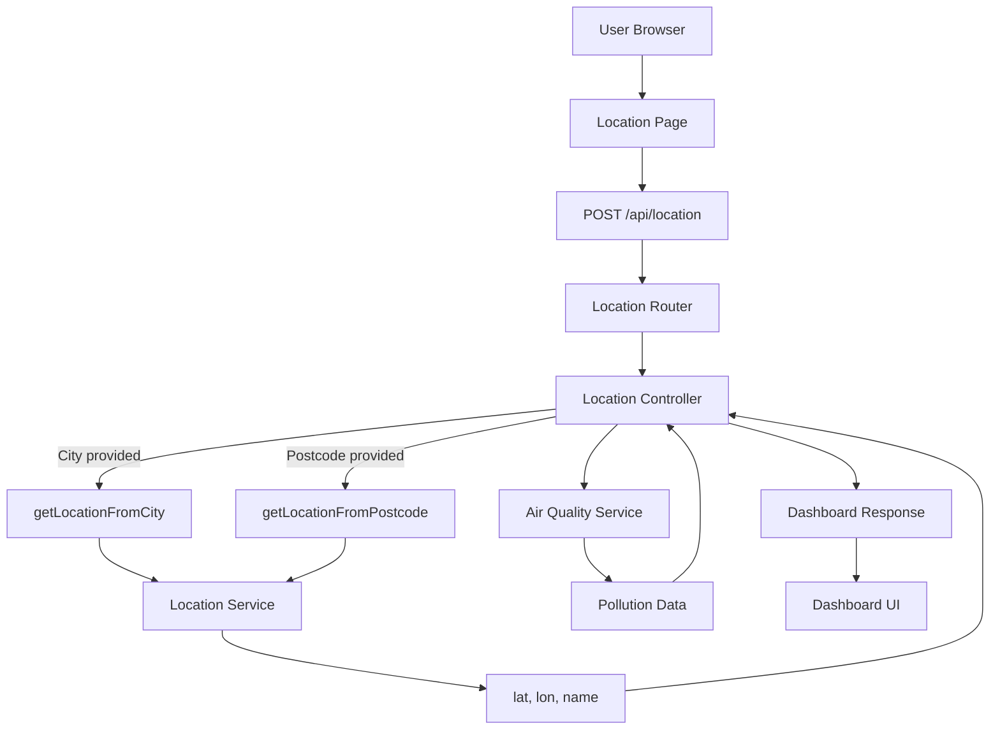

# Location Logic

```mermaid
    flowchart TD
    A[User Browser] --> B[Location Page]

    B --> C[POST /api/location]

    C --> D[Location Router]

    D --> E[Location Controller]

    E -->|City provided| F[getLocationFromCity]
    E -->|Postcode provided| G[getLocationFromPostcode]

    F --> H[Location Service]
    G --> H[Location Service]

    H --> I[lat, lon, name]

    I --> E

    E --> J[Air Quality Service]

    J --> K[Pollution Data]

    K --> E

    E --> L[Dashboard Response]

    L --> M[Dashboard UI]
```