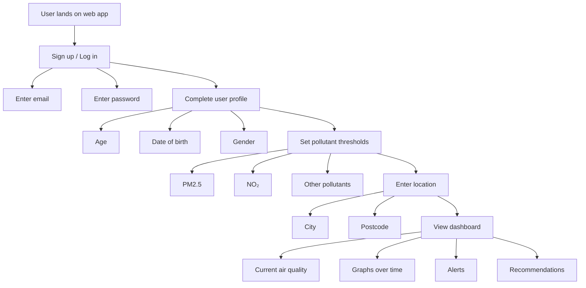

# User Journey

```mermaid
flowchart TD
    A[User lands on web app]
    A --> B[Sign up / Log in]
    B --> B1[Enter email]
    B --> B2[Enter password]

    B --> C[Complete user profile]
    C --> C1[Age]
    C --> C2[Date of birth]
    C --> C3[Gender]

    C --> D[Set pollutant thresholds]
    D --> D1[PM2.5]
    D --> D2[NO₂]
    D --> D3[Other pollutants]

    D --> E[Enter location]
    E --> E1[City]
    E --> E2[Postcode]

    E --> F[View dashboard]
    F --> F1[Current air quality]
    F --> F2[Graphs over time]
    F --> F3[Alerts]
    F --> F4[Recommendations]
```